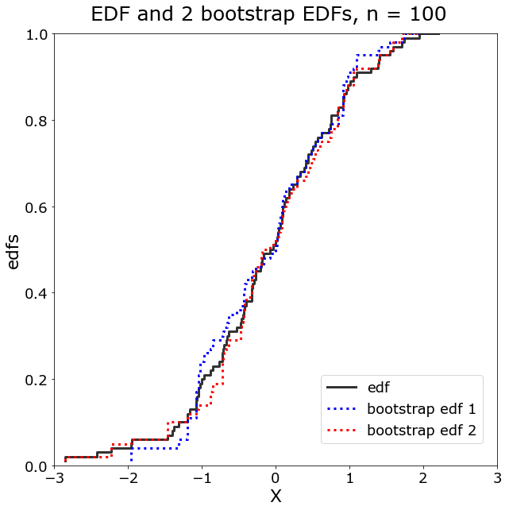

[](http://quantlet.de/)

## [](http://quantlet.de/) **MVAedfbootstrap** [](http://quantlet.de/)

```yaml

Name of QuantLet: MVAedfbootstrap

Published in: Applied Multivariate Statistical Analysis

Description: Draws bootstrap samples from a simulate data standard normal dataset and plots their empirical distribution functions (edf).

Keywords: edf, bootstrap, plot, graphical representation, multivariate, small-samples, distribution, sas

See also: MVAedfnormal

Author: Vladimir Georgescu, Jorge Patron, Song Song, Awdesch Melzer
Author[SAS]: Svetlana Bykovskaya
Author[Python]: Matthias Fengler, Tim Dass

Submitted: Thu, October 16 2014 by Petra Burdejova
Submitted[SAS]: Wen, April 6 2016 by Svetlana Bykovskaya
Submitted[Python]: Tue, April 16 2024 by Tim Dass

```





### PYTHON Code
```python

# works on numpy 1.24.3, scipy 1.10.1, statsmodels 0.14.0 and matplotlib 3.6.2
import numpy as np
import matplotlib.pyplot as plt
from scipy.stats import norm
from statsmodels.distributions.empirical_distribution import ECDF

n = 100
x = norm.rvs(size=100)
xs1 = x[np.floor(n * np.random.uniform(size=n)).astype(int)]
xs2 = x[np.floor(n * np.random.uniform(size=n)).astype(int)]
xx = ECDF(x)
xx1 = ECDF(xs1)
xx2 = ECDF(xs2)

fig, ax = plt.subplots(1,1, figsize=(10,10))
ax.step(xx.x,xx.y, label = 'edf', c = 'black', lw = 3, alpha = 0.8)
ax.step(xx1.x, xx1.y, 'b:', label = 'bootstrap edf 1', lw = 3)
ax.step(xx2.x, xx2.y, 'r:', label = 'bootstrap edf 2', lw = 3)
fig.suptitle("EDF and 2 bootstrap EDFs, n = 100", fontsize = 25, y = 0.93)
ax.set_xlim(-3, 3)
ax.set_ylim(0, 1)
ax.set_xlabel("X", fontsize = 22)
ax.set_ylabel("edfs", fontsize = 22)
ax.tick_params(axis='x', labelsize=18)
ax.tick_params(axis='y', labelsize=18)
fig.legend(loc =(0.63, 0.13), fontsize = 18)

plt.show()
```

automatically created on 2024-04-25

### R Code
```r


# clear variables and close windows
rm(list = ls(all = TRUE))
graphics.off()

# install and load packages
libraries = c("matlab")
lapply(libraries, function(x) if (!(x %in% installed.packages())) {
    install.packages(x)
})
lapply(libraries, library, quietly = TRUE, character.only = TRUE)

n   = 100
x   = rnorm(n, 0, 1)
x   = sort(x)
a   = (1:n - 1)/n
aa  = cbind(x[2:n], a[2:n])
bb  = cbind(x[1:n - 1], a[2:n])
cc  = rbind(aa, bb)
edf = apply(cc, 2, sort)
end = dim(edf)[1]
edf = rbind(c(edf[1, 1], 0), edf, c(edf[end, 1], 1))

# First bootstrap sample
xs1 = x[ceil(n * runif(n, 0, 1))]

# Second bootstrap sample
xs2 = x[ceil(n * runif(n, 0, 1))]

# Sorting the first sample
aa1   = cbind(xs1[2:n], a[2:n])
bb1   = cbind(xs1[1:n - 1], a[2:n])
cc1   = rbind(aa1, bb1)
edfs1 = apply(cc1, 2, sort)
end1  = dim(edfs1)[1]
edfs1 = rbind(c(edfs1[1, 1], 0), edfs1, c(edfs1[end1, 1], 1))

# Sorting the second sample
aa2   = cbind(xs2[2:n], a[2:n])
bb2   = cbind(xs2[1:n - 1], a[2:n])
cc2   = rbind(aa2, bb2)
edfs2 = apply(cc2, 2, sort)
end2  = dim(edfs2)[1]
edfs2 = rbind(c(edfs2[1, 1], 0), edfs2, c(edfs2[end2, 1], 1))

# Plot
plot(edf[, 1], edf[, 2], type = "l", col = "black", lwd = 3.5, xlab = "X", ylab = "edfs[1..3](x)")
title(paste("EDF and 2 bootstrap EDFs, n = ", n))
lines(edfs1[, 1], edfs1[, 2], col = "red3", lwd = 1.5, lty = "dotted")
lines(edfs2[, 1], edfs2[, 2], col = "blue3", lwd = 1.5, lty = "dashed")
legend(x = min(x), y = 1, legend = c("edf", "1. bootstrap edf", "2. bootstrap edf"), 
    pch = c(20, 20), col = c("black", "blue3", "red3")) 

```

automatically created on 2024-04-25

### SAS Code
```sas

proc iml;
  start Sorting(x,n);
    a   = (0:n - 1) / n;
    aa  = x[2:n] || a[2:n];
    bb  = x[1:n - 1] || a[2:n];
    cc  = aa // bb;
    call SORTNDX(idx1, cc, 1);
    call SORTNDX(idx2, cc, 2);
    edf = (cc[idx1, 1]) || (cc[idx2, 2]);
    end = nrow(cc);
    edf = (edf[1, 1] || {0}) // edf // (edf[end, 1] || {1});
    return(edf);
  finish;
  
  %let n = 100;
  n = &n; 
  x = randnormal(n, 0, 1);
  call sort(x, 1);
  edf = Sorting(x,n);
  
  * First bootstrap sample;
  xs1 = x[ceil(n * randfun(n, "Uniform"))];
  
  * Second bootstrap sample;
  xs2 = x[ceil(n * randfun(n, "Uniform"))];
  
  * Sorting the first sample;
  edfs1 = Sorting(xs1,n);
  
  * Sorting the second sample;
  edfs2 = Sorting(xs2,n);
  
  x11 = edf[, 1];
  x12 = edf[, 2];
  x21 = edfs1[, 1];
  x22 = edfs1[, 2];
  x31 = edfs2[, 1];
  x32 = edfs2[, 2];
  
  create plot var {"x11" "x12" "x21" "x22" "x31" "x32"};
    append;
  close plot; 
quit;

proc sgplot data = plot;
  title 'EDF and 2 bootstrap EDFs, n = '&n;
  series x = x11 y = x12 / lineattrs = (color = black THICKNESS = 2)
    legendlabel = "edf";
  series x = x21 y = x22 / lineattrs = (color = red THICKNESS = 2)
    legendlabel = "bootstrap edf 1";
  series x = x31 y = x32 / lineattrs = (color = blue THICKNESS = 2)
    legendlabel = "bootstrap edf 2";
  xaxis label = 'X';
  yaxis label = 'edfs';
run;

```

automatically created on 2024-04-25